

  
  
  

---

<h1 align="center"> Hospital Management System</h1>

A Java Swing-based desktop application built using Object-Oriented Programming principles. 
No database is used — all data is stored using simple TXT files.

  
  

##  Project Overview

This project simulates a real hospital management system including multiple roles:

- Admin
- Doctor
- Receptionist
- Patient

It demonstrates core OOP concepts and file handling without using any database.

## Tech Stack

- Java (OOP)
- Java Swing (GUI)
- AWT
- File Handling (TXT files)

## Project Screenshots

  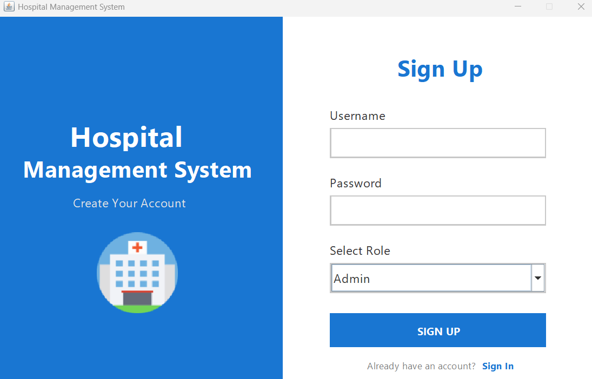

  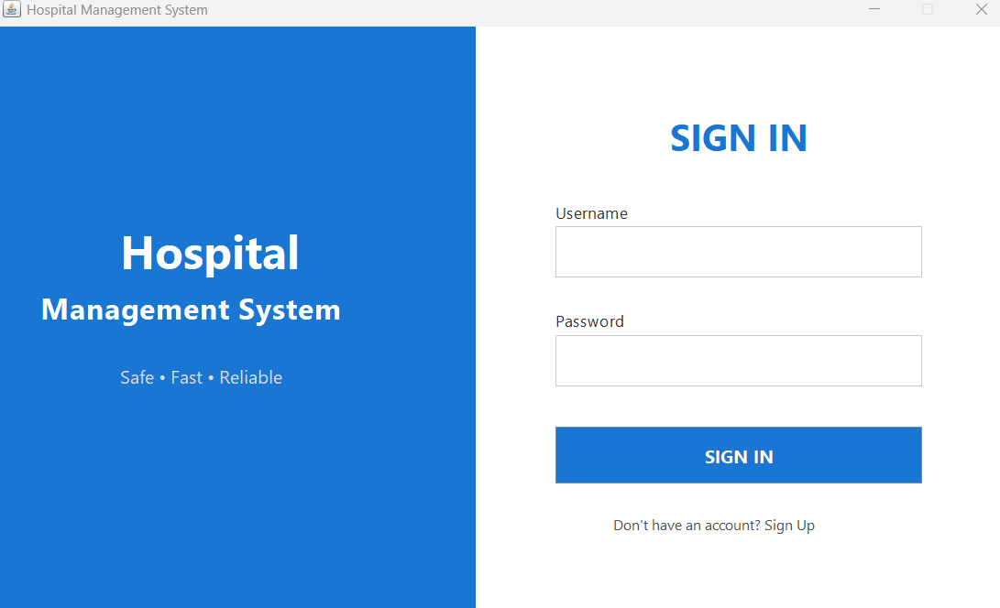

---

  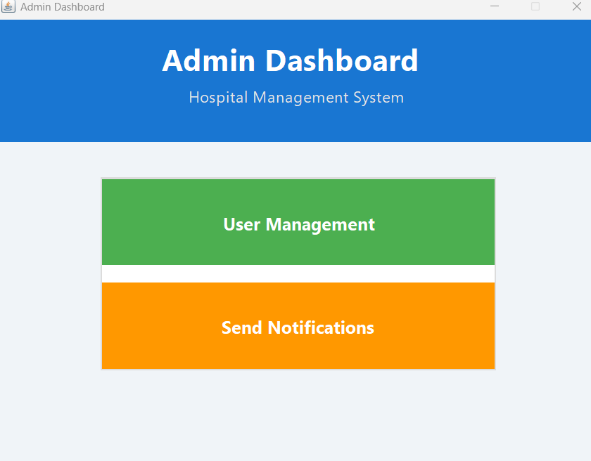

  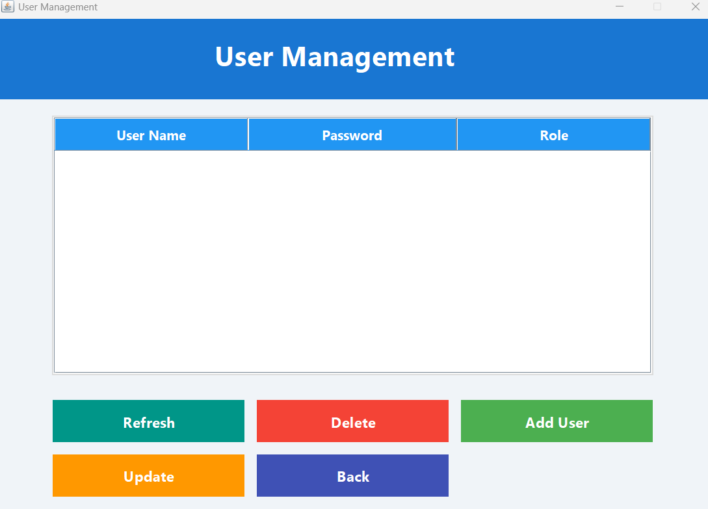

  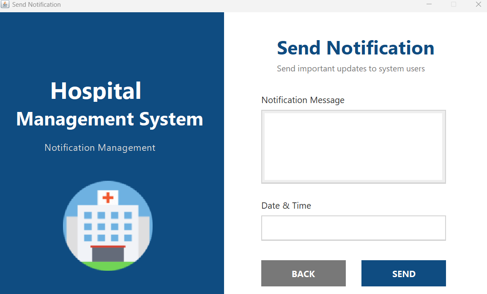

---

  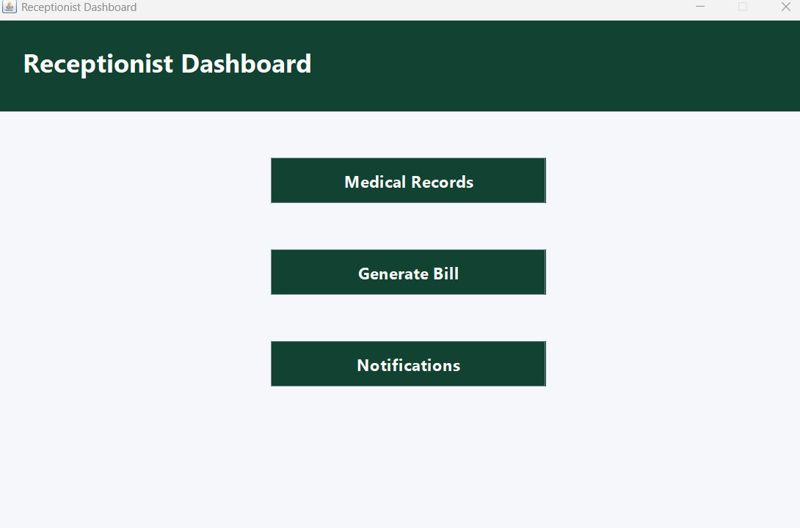

  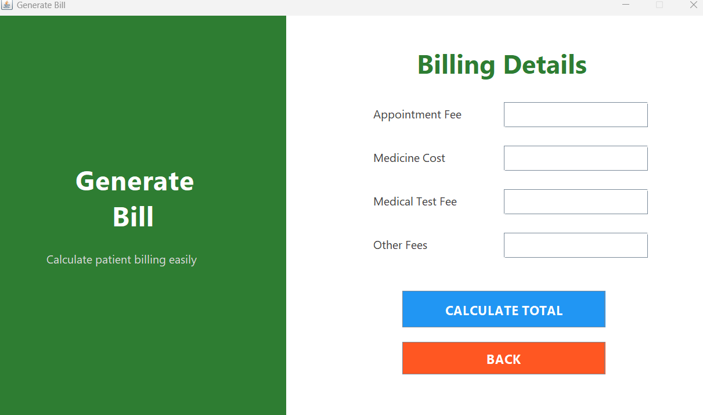

---

  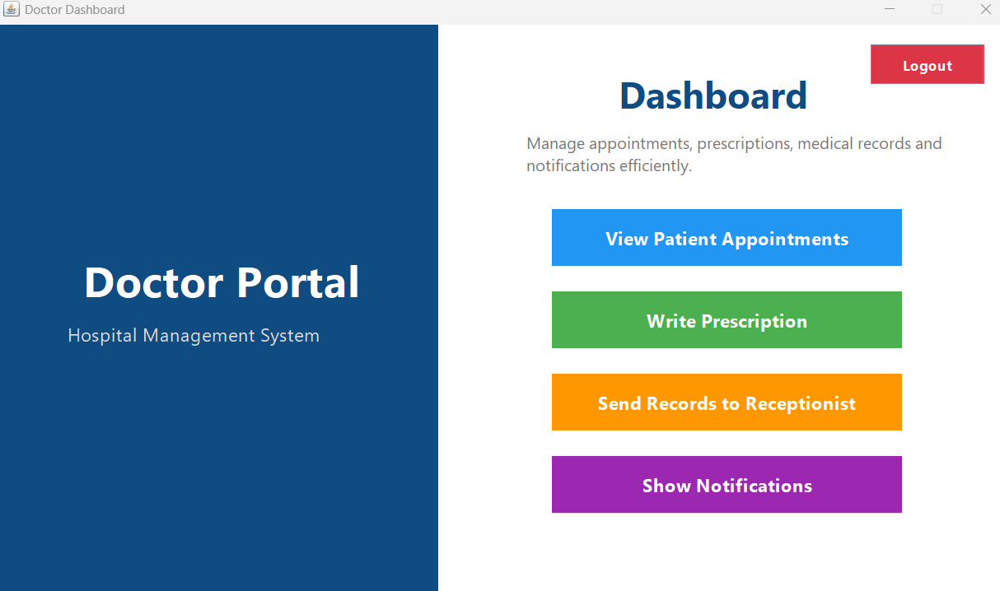

  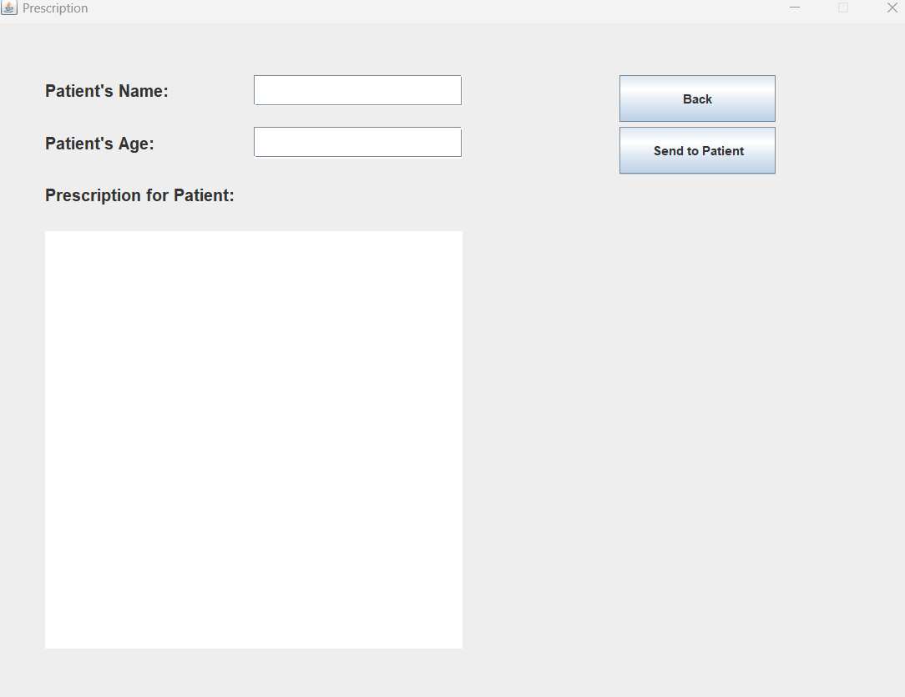

---

  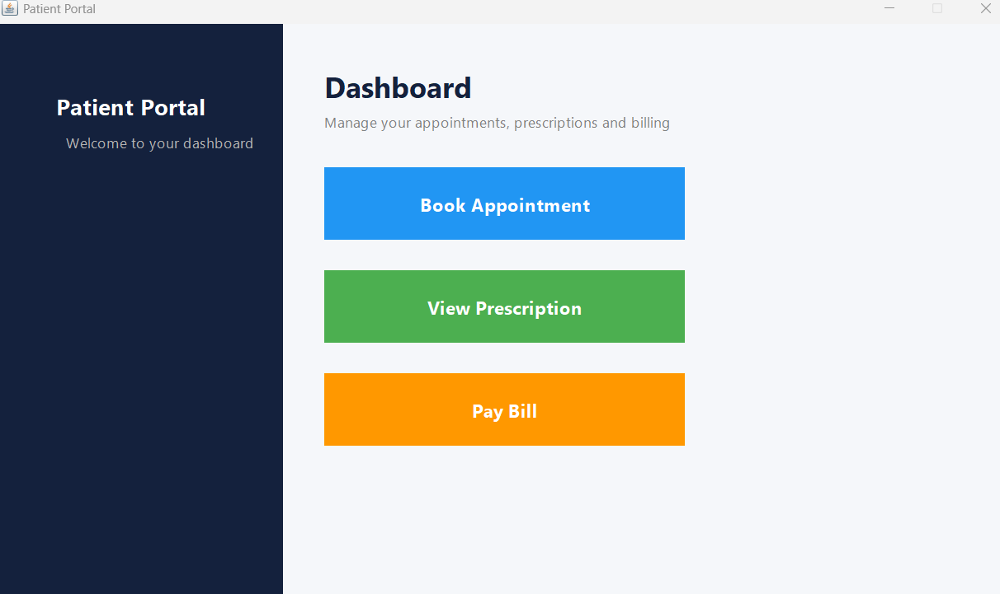

  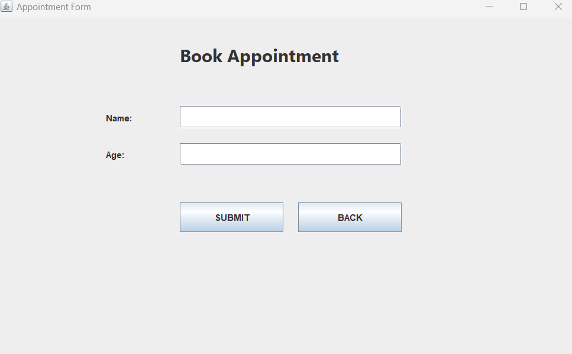

  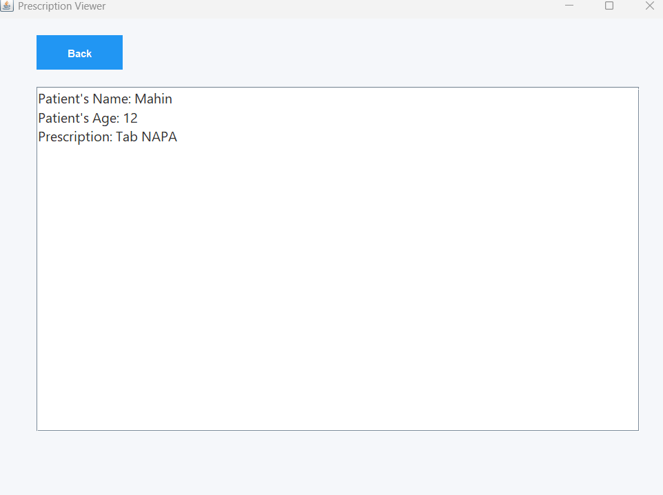

  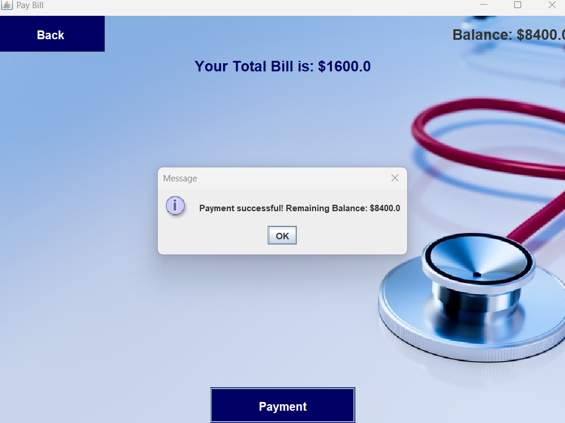

